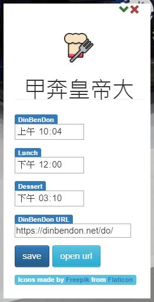
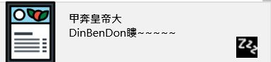
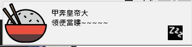
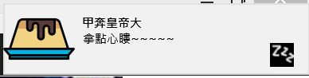
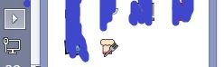
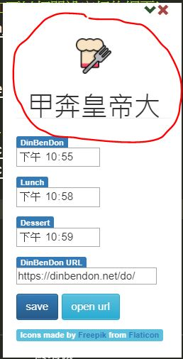

# 甲奔皇帝大 electron 版本

## 動機
為了防止在大家開開心心吃便當和點心時，自己忘記訂便當和拿點心，因此做了甲奔皇帝大。  
然後因為想玩玩electron，所以將原本的[甲奔皇帝大  google extension 版本](https://github.com/zondaTW/Jia_Ben_Hung_Da_Dwa)改成electron實現。  

## 畫面
  

#### 訂便當通知(點擊通知可以打開設定好的網頁)  
  

#### 領便當通知(點擊通知可以打開設定好的網頁)  
  

#### 拿點心通知  
  

#### 縮到最小(點擊Setting叫回視窗)  
  
  

#### 移動視窗(目前因技術問題，要移動視窗時，請點選紅色圈圈內的範圍)  
  

## 使用方式

### npm
`npm install`  
`npm start`  

### packager
`npm run build`  

### installer
`npm run pack`  
path: `C:\Users\{username}\AppData\Local\Jia_Ben_Hung_Da_Dwa`

## Reference
[Electron - 新手入門 - 做一個鬧鐘吧](https://dotblogs.com.tw/explooosion/2018/03/25/181604)  
[[electron學習筆記]electron安裝檔打包攻略](http://a091234765.pixnet.net/blog/post/402437864-[electron學習筆記]electron安裝檔打包攻略)  
[Creating a Windows Distribution of an Electron App using Squirrel](http://mylifeforthecode.com/creating-a-windows-distribution-of-an-electron-app-using-squirrel/)  

圖片來源：<http://www.flaticon.com/packs/food-and-drinks-16>  

# note
build完後，要重開機，要不然exe檔的icon圖示不會換。  